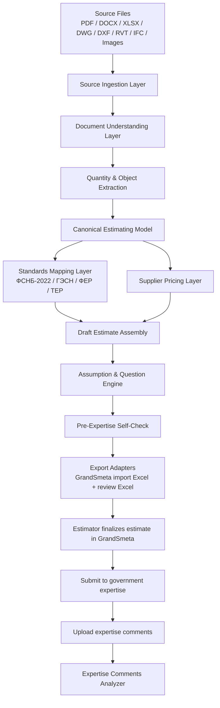

# AI-Smeta-RU Target Architecture

## 1. Overview

The target architecture is a layered estimating platform built on top of OpenConstructionERP.

It combines:
- source ingestion
- document and drawing understanding
- quantity extraction
- Russian standards mapping
- supplier pricing and RFQ workflows
- draft estimate assembly and export to GrandSmeta-ready formats

The architecture is designed for human-in-the-loop operation. AI is used to accelerate extraction and draft generation, while estimators maintain review and approval authority. GrandSmeta is the authoritative estimating environment for final estimate production in MVP.

---

## 2. Architectural Principles

1. Source-first traceability
   - every estimate position must be linked to a source file or source object

2. Canonical estimating model
   - extracted data is normalized into a shared internal structure before any downstream output is generated

3. Standards-aware generation
   - estimation outputs must explicitly connect to Russian standards and reference systems

4. Supplier-aware pricing
   - material and equipment pricing must include validity, region, VAT, currency, and delivery assumptions

5. Human review gates
   - no final estimate should be accepted without review of assumptions, norm mapping, and supplier comparison

---

## 3. High-Level Architecture

---

## 4. Layered Component Design

### 4.1 Source Ingestion Layer

Responsibilities:
- receive and store project source files
- preserve file metadata and file versions
- detect file type and route to the right parser

Primary repository fit:
- `backend/app/modules/documents`
- `backend/app/modules/takeoff`
- `backend/app/modules/dwg_takeoff`
- `backend/app/modules/bim_hub`

### 4.2 Document Understanding Layer

Responsibilities:
- data extraction from scanned documents and images
- table extraction from Excel / Word / specifications
- section and entity classification
- metadata extraction from drawings and BIM files

Primary repository fit:
- extension of `takeoff`
- extension of `dwg_takeoff`
- new `document_understanding` module

### 4.3 Quantity and Object Extraction Layer

Responsibilities:
- transform parsed content into structured estimating objects
- extract work items, quantities, materials, equipment, openings, reinforcement, finishes, installations, rooms, zones, floors, MEP systems, and structural elements
- attach provenance to every extracted object

Primary repository fit:
- extension of `takeoff`
- extension of `dwg_takeoff`
- new `quantity_normalization` module

### 4.4 Canonical Estimating Model

This is the internal core model used by all downstream modules.

Core entities:
- `Project`
- `SourceArtifact`
- `ExtractedObject`
- `WorkPackage`
- `EstimatePosition`
- `NormReference`
- `SupplierQuote`
- `RFQRequest`
- `Assumption`
- `Question`

The model should support:
- multiple source links per position
- multiple norm mappings per item
- multiple supplier options per material or equipment
- review history and versioning

### 4.5 Standards Mapping Layer

Responsibilities:
- map work items to Russian norms and cost references
- select candidate references from ФСНБ-2022, ГЭСН, ФЕР, and ТЕР
- capture confidence and rule rationale

Primary repository fit:
- extension of `costs`
- extension of `russia_pack`
- new `standards_mapping` module

### 4.6 Supplier Pricing Layer

Responsibilities:
- store internal supplier data
- ingest uploaded price lists and manual offers
- compare alternatives
- enforce validity dates and regional constraints
- manage VAT, currency, delivery cost, and alternative-supplier options

Primary repository fit:
- existing `supplier_catalogs`
- existing `procurement` / `rfq_bidding`
- new `supplier_pricing_engine`

### 4.7 Estimate Drafting and Review Layer

Responsibilities:
- assemble draft BOQ / VOR / estimate positions
- generate questions and assumptions
- support estimator review and approval

Primary repository fit:
- existing `ai_estimator`
- existing `boq`
- new `assumption_engine`

### 4.8 Export Layer

Responsibilities:
- generate GrandSmeta import Excel and review Excel packages
- prepare downstream workflows for GrandSmeta and future SmetaPlan export

Primary repository fit:
- existing `boq`
- new `grandsmeta_excel_export_ru`

---

## 5. Repository Mapping

### Existing modules to reuse

| Existing module | Role in target architecture |
|---|---|
| `takeoff` | PDF / image / plan-reading extraction |
| `dwg_takeoff` | DWG / DXF parsing and drawing-derived extraction |
| `ai_estimator` | orchestration of estimating workflow and review stages |
| `costs` | price and cost matching engine |
| `boq` | BOQ and estimate position persistence |
| `russia_pack` | Russian regional configuration and standards defaults |
| `supplier_catalogs` | supplier catalog foundation |
| `procurement` / `rfq_bidding` | RFQ and offer workflow foundation |
| `documents` | source artifact storage |

### Modules to extend

- `takeoff`
- `dwg_takeoff`
- `ai_estimator`
- `costs`
- `boq`
- `russia_pack`
- `supplier_catalogs`
- `procurement`

### Modules to create

- `ai_smeta_ru`
- `source_ingestion`
- `document_understanding`
- `quantity_normalization`
- `standards_mapping`
- `supplier_pricing_engine`
- `rfq_orchestrator`
- `grandsmeta_excel_export_ru`
- `assumption_engine`
- `pre_expertise_self_check_ru`
- `expertise_comments_analyzer_ru`

---

## 6. Data Flow

1. Source files are uploaded and stored.
2. The ingestion layer detects the source type and routes the file.
3. Parsers extract raw content, geometry, metadata, and table structures.
4. The normalization layer converts the extracted data into canonical estimate objects.
5. The standards mapping layer assigns candidates for Russian norms.
6. The pricing layer attaches material / equipment price options.
5. The drafting engine creates a BOQ / VOR / draft estimate package.
8. The assumption engine creates follow-up questions and risk notes.
9. Estimators review the draft and confirm or edit it.
10. The export layer creates GrandSmeta import Excel plus review Excel and downstream data structures.
11. The estimator finalizes the estimate inside GrandSmeta, then submits it to government expertise.
12. Expertise comments are uploaded back into the AI system and analyzed for linkage to items, norms, assumptions, source documents, and missing-data issues.

---

## 7. MVP Architecture Scope

The MVP should implement the following boundaries:

- ingestion of a limited set of source types
- one-pass normalization into estimate objects
- limited Russian norm mapping coverage
- price matching using internal catalog and uploaded Excel price lists
- draft BOQ / estimate generation with human review
- Excel export and RFQ comparison output

The MVP should avoid full semantic BIM reasoning and full external supplier integration in the first release.

---

## 8. Risks to Architecture Design

- source quality variability
- inconsistent units and naming conventions
- lack of authoritative norm data in some trades
- incomplete supplier datasets
- ambiguity in design information and missing specifications
- dependence on AI model reliability and prompt quality

Mitigation:
- preserve provenance and manual review stages
- define explicit assumptions and unresolved question handling
- make the standards mapping layer configurable and auditable
- support staged rollout by source type and discipline
