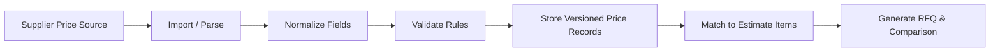

# Supplier Price Database Strategy

## 1. Purpose

This document defines the strategy for integrating supplier pricing into the AI-Smeta-RU estimating workflow.

The objective is to support:
- internal supplier price data
- uploaded supplier price lists in Excel / PDF
- supplier websites and APIs where available
- manual commercial offers
- periodic price refresh
- regional price validity and delivery logic
- VAT, currency, delivery cost, and alternative material/equipment options

---

## 2. Strategic Objectives

1. Create a single supplier pricing layer for estimating and procurement
2. Keep supplier prices auditable and versioned
3. Support both internal and external price sources
4. Enable RFQ creation and commercial-offer comparison
5. Make pricing region-aware and validity-aware
6. Support alternative products and substitutions

---

## 3. Core Data Model

The supplier pricing model should include the following fields:

- supplier identity
- product or equipment identity
- category and trade classification
- description and technical specification
- unit of measure
- price amount
- currency
- VAT rate or VAT-inclusive status
- delivery region
- delivery cost
- validity start and end dates
- lead time
- source type: internal, uploaded, website, API, manual offer
- source artifact reference
- version and update timestamp
- alternative material / equipment references
- confidence and review status

---

## 4. Ingestion Channels

### 4.1 Internal supplier database
Use for approved supplier contract pricing and standard catalog items.

### 4.2 Uploaded supplier price lists
Support:
- Excel / XLSX
- PDF price sheets
- manually entered tables

### 4.3 Supplier websites
Useful where no structured API is available.

### 4.4 Supplier APIs
Best for automated and repeatable refreshes.

### 4.5 Manual commercial offers
Needed for bespoke or negotiated pricing.

---

## 5. Price Governance Rules

The pricing system should enforce:
- validity date checks for all prices
- currency normalization
- delivery-region awareness
- VAT and tax handling
- price source provenance
- review flags for obsolete or stale pricing

### Minimum governance requirements
- every price row must have a source and validity period
- every price row must be traceable to its import or offer source
- every supplier alternative must be clearly distinguishable from the primary option

---

## 6. Matching and Comparison Strategy

The system should match estimate items to supplier offerings using:
- normalized description matching
- classification / trade mapping
- unit-of-measure normalization
- material and equipment attribute matching
- region and delivery constraints

The comparison flow should produce:
- ranked supplier offers
- price difference summaries
- delivery and lead-time differences
- VAT and currency differences
- alternative product suggestions

---

## 7. Workflow Design

### 7.1 Intake
- import supplier prices from approved sources
- store them as versioned records

### 7.2 Validation
- verify format, units, currency, and validity dates
- flag incomplete or inconsistent rows

### 7.3 Matching
- match incoming estimate positions to available supplier records

### 7.4 RFQ generation
- create RFQ lists for selected items
- send to relevant suppliers or prepare internal comparison tracking

### 7.5 Offer comparison
- compare offers with a commercial-offer matrix
- highlight best-value options and alternatives

### 7.6 Refresh cycle
- periodically refresh prices using the configured source channels

---

## 8. Recommended MVP

The MVP should include:
- internal supplier price records
- Excel-based upload for supplier price lists
- manual commercial offer entry
- price validity dates and region field
- simple comparison table for selected materials and equipment
- basic RFQ generation for shortlisted items

The MVP should not attempt full website scraping or deep API integration in the first release.

---

## 9. Recommended Data Processing Pipeline

---

## 10. Risks and Dependencies

- incomplete supplier catalog data
- inconsistent units and naming between suppliers
- price changes without refresh automation
- lack of authoritative technical specifications for alternatives
- unavailable supplier APIs

Mitigation:
- require review and versioning for every updated price row
- define canonical product descriptors and unit mappings
- support manual override and review when automated ingestion fails

---

## 11. Repository Fit

The existing repository already provides a good foundation for this strategy:
- `supplier_catalogs` for supplier price records and organization
- `procurement` / `rfq_bidding` for RFQ and bid workflows
- `costs` for regional cost matching and catalog logic
- `boq` for linking price decisions to estimate positions

The new `supplier_pricing_engine` module should sit above these existing modules and provide the orchestration, validation, and comparison logic.
